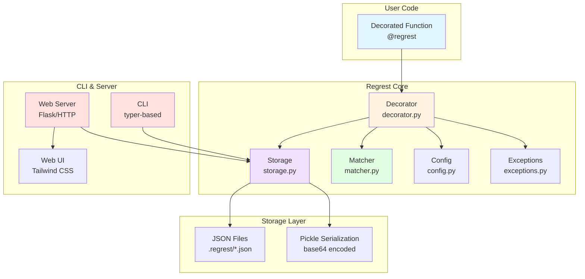

# Regrest

[English](https://github.com/eycjur/regrest/blob/main/README.md) | [日本語](https://github.com/eycjur/regrest/blob/main/README_ja.md)

[](https://badge.fury.io/py/regrest)
[](https://www.python.org/downloads/)
[](https://opensource.org/licenses/MIT)
[](https://github.com/eycjur/regrest/actions/workflows/test.yml)
[](https://github.com/eycjur/regrest/actions/workflows/static_analysis.yml)
[](https://deepwiki.com/eycjur/regrest)

**Regrest** is a simple and powerful regression testing tool for Python. It automatically records function outputs on the first run and validates them on subsequent runs.

## Features

- 🎯 **Simple decorator-based API** - Just add `@regrest` to your functions
- 📝 **Automatic recording** - First run records outputs, subsequent runs validate
- 🔍 **Smart comparison** - Handles floats, dicts, lists, nested structures, and custom classes
- 🛠 **CLI tools** - List, view, delete, and visualize test records
- 📊 **Web visualization** - Beautiful dashboard with JSONesque display, hierarchical navigation, and hot reload
- ⚙️ **Configurable** - Custom tolerance, storage location, and more
- 🔧 **Auto .gitignore** - Automatically creates `.regrest/.gitignore` to exclude test records on first run

## Requirements

- Python 3.9 or higher

## Installation

```bash
pip install regrest

# Optional: Install with Flask for better server performance
pip install regrest[server]
```

## Quick Start

### Basic Usage

```python
from regrest import regrest

@regrest
def calculate_price(items, discount=0):
    total = sum(item['price'] for item in items)
    return total * (1 - discount)

# First run: records the result
items = [{'price': 100}, {'price': 200}]
result = calculate_price(items, discount=0.1)  # Returns 270.0, records it
# Output: [regrest] Recorded: __main__.calculate_price (id: abc123...)

# Second run: validates against recorded result
result = calculate_price(items, discount=0.1)  # Returns 270.0, compares with record
# Output: [regrest] Passed: __main__.calculate_price (id: abc123...)
```

### Custom Tolerance

```python
@regrest(tolerance=1e-6)
def calculate_pi():
    return 3.14159265359
```

### Update Mode

To update existing records instead of testing:

```python
@regrest(update=True)
def my_function():
    return "new result"
```

Or set the environment variable:

```bash
REGREST_UPDATE_MODE=1 python your_script.py
```

## Environment Variables

| Variable | Description | Values | Default |
|----------|-------------|--------|---------|
| `REGREST_LOG_LEVEL` | Log level | DEBUG, INFO, WARNING, ERROR, CRITICAL | `INFO` |
| `REGREST_RAISE_ON_ERROR` | Raise exceptions on test failure | True/False | `False` |
| `REGREST_UPDATE_MODE` | Update all records | True/False | `False` |
| `REGREST_STORAGE_DIR` | Custom storage directory | Directory path | `.regrest` |
| `REGREST_FLOAT_TOLERANCE` | Float comparison tolerance | Numeric value | `1e-9` |

**Priority**: Constructor arguments > Environment variables > Default values

## CLI Commands

### List Records

```bash
regrest list              # List all records
regrest list -k calculate # Filter by keyword
```

Lists all test records with module, function, arguments, results, and timestamps.

### Delete Records

```bash
regrest delete abc123def456      # Delete by ID
regrest delete --pattern "test_*" # Delete by pattern
regrest delete --all             # Delete all records
```

### Serve Web UI

```bash
regrest serve                    # Start on localhost:8000
regrest serve --port 8080        # Custom port
regrest serve --host 0.0.0.0     # Allow external access
regrest serve --reload           # Enable hot reload
```

Access the web UI at `http://localhost:8000` for:
- **Hierarchical view** - Organized by module → function → record
- **Search & filter** - Find records by keyword
- **JSONesque display** - Syntax-highlighted, readable format
- **Record management** - Delete individual or all records

## Architecture

### System Overview



## How It Works

1. **First Run**: When you call a function decorated with `@regrest`, it executes normally and saves:
   - Module and function name
   - Arguments (args and kwargs)
   - Return value
   - Timestamp

   The record is saved to `.regrest/` directory as a JSON file.

2. **Subsequent Runs**: On the next call with the same arguments:
   - The function executes
   - The result is compared with the recorded value
   - If they match → Test passes ✅
   - If they don't match → `RegressionTestError` is raised ❌

3. **Update Mode**: When you need to update the expected values:
   - Use `@regrest(update=True)` or `REGREST_UPDATE_MODE=1`
   - The old record is replaced with the new result

## Configuration

| Level | Usage | Example |
|-------|-------|---------|
| **Global** | Configure all tests | `from regrest import Config, set_config`<br>`config = Config(storage_dir='.my_records', float_tolerance=1e-6)`<br>`set_config(config)` |
| **Per-function** | Configure specific function | `@regrest(tolerance=1e-9)`<br>`def precise_calculation():`<br>`    return 3.141592653589793` |

## Advanced Features

### Comparison Logic

The matcher intelligently compares:
- **Primitives**: Exact match for strings, booleans
- **Numbers**: Tolerance-based for floats, exact for integers
- **Collections**: Deep comparison for lists, dicts, sets
- **Nested structures**: Recursive comparison with detailed error messages

## Storage Format

### File Structure

Records are stored as JSON files in the `.regrest/` directory:

```
.regrest/
├── .gitignore                                    # Auto-generated
├── example.calculate_price.a1b2c3d4.json       # Record file
└── mymodule.process_data.e5f6g7h8.json        # Record file
```

### File Naming Convention

`{module}.{function}.{record_id}.json`

| Component | Description | Example |
|-----------|-------------|---------|
| `module` | Module name where function is defined | `example`, `mymodule` |
| `function` | Function name | `calculate_price`, `process_data` |
| `record_id` | SHA256 hash of arguments (first 16 chars) | `a1b2c3d4e5f6g7h8` |

**Record ID Generation**: Records are uniquely identified by:
1. Module name
2. Function name
3. SHA256 hash of serialized arguments (args + kwargs)

This means **different argument combinations create separate records** for the same function.

### Encoding Strategy

Regrest uses a **hybrid encoding** approach for maximum compatibility and readability:

| Data Type | Storage Method | Readable | Example |
|-----------|---------------|----------|---------|
| **JSON-serializable**<br>(int, float, str, bool, list, dict, None) | JSON | ✅ Yes | `{"result": {"type": "json", "data": 270.0}}` |
| **Non-JSON-serializable**<br>(custom classes, complex objects) | Pickle + Base64 | ❌ No | `{"result": {"type": "pickle", "data": "gASV..."}}` |

**Advantages**:
- ✅ **Readable**: Simple data types are stored as JSON for easy inspection
- ✅ **Flexible**: Complex objects are automatically pickled
- ✅ **Version control friendly**: JSON format produces clean diffs

**Considerations**:
- ⚠️ **Pickle compatibility**: May have issues across different Python versions
- ⚠️ **Custom classes**: Must be pickle-serializable and implement `__eq__` for comparison

## Best Practices

| Practice | Description |
|----------|-------------|
| **Deterministic functions** | Use `@regrest` only on functions with consistent outputs (same input → same output) |
| **Auto .gitignore** | Test records are automatically excluded from git via `.regrest/.gitignore` |
| **Update workflow** | When intentionally changing behavior, update records: `REGREST_UPDATE_MODE=1 python script.py` |

## Limitations

| Limitation | Description |
|------------|-------------|
| **Python version** | Requires Python 3.9+ |
| **Non-deterministic functions** | Don't use on functions with random outputs, timestamps, or external API calls |
| **Serialization** | Data must be JSON or pickle-serializable; custom classes need `__eq__` for comparison |
| **Pickle compatibility** | May have issues across different Python versions |

## Contributing

Contributions welcome! Run `make check` before submitting PRs.

## License

MIT License

## Changelog

### 0.1.0 (Initial Release)
- **Published to PyPI** - Install with `pip install regrest`
- Core decorator functionality (`@regrest`)
- Hybrid JSON/Pickle storage system
- Smart comparison with floating-point tolerance
- CLI tools (`regrest list`, `regrest delete`)
- Custom class support
- Auto `.gitignore` generation
- Environment variable configuration
- Colorful logging output
- Python 3.9+ support
- pyproject.toml-based build system
- ruff + mypy static analysis
- Makefile task automation
- GitHub Actions CI/CD
