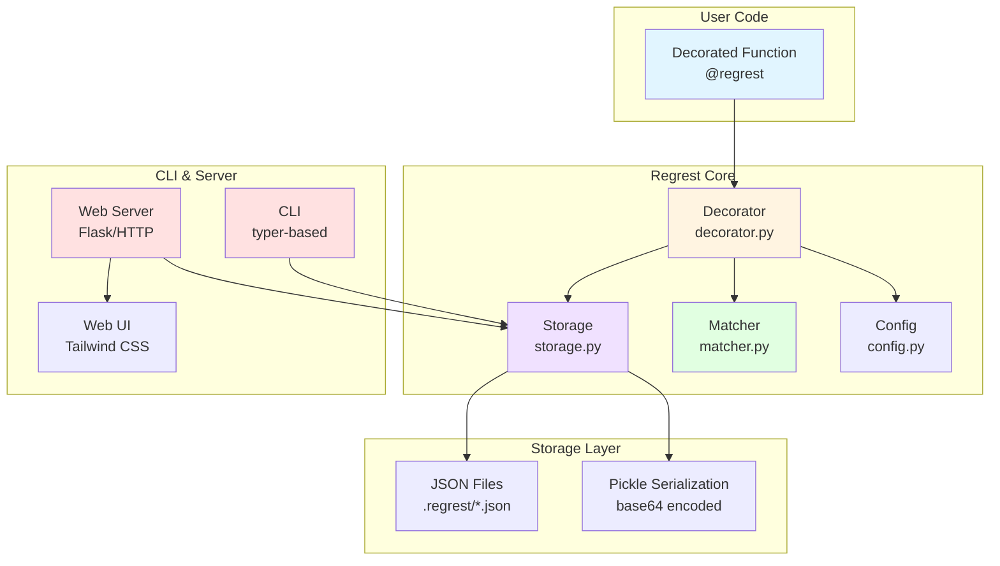

# Regrest

[English](https://github.com/eycjur/regrest/blob/main/README.md) | [日本語](https://github.com/eycjur/regrest/blob/main/README_ja.md)

[](https://badge.fury.io/py/regrest)
[](https://www.python.org/downloads/)
[](https://opensource.org/licenses/MIT)
[](https://github.com/eycjur/regrest/actions/workflows/test.yml)
[](https://github.com/eycjur/regrest/actions/workflows/static_analysis.yml)
[](https://deepwiki.com/eycjur/regrest)

**Regrest** is an automated regression testing and debugging tool for Python. It automatically records function outputs on the first run and validates them on subsequent runs, while providing powerful visualization capabilities for understanding complex data flows.

## Features

- 🎯 **Zero-effort regression testing** - Catch unintended changes without writing test code
- 📝 **Automatic test generation** - Just add `@regrest` decorator, tests are created automatically
- 🔬 **Visual debugging** - Understand complex data flows by visualizing function inputs and outputs
- 📊 **Beautiful web dashboard** - Explore recorded data with syntax highlighting and hierarchical navigation
- ⚡ **Faster debugging cycles** - Reproduce issues instantly with saved inputs
- 📚 **Living documentation** - Function behavior examples generated automatically from real executions

## Requirements

- Python 3.9 or higher

## Installation

```bash
pip install regrest

# Optional: Install with Flask for better server performance
pip install regrest[server]
```

## Quick Start

### Basic Usage

```python
from regrest import regrest

@regrest
def calculate_price(items, discount=0):
    total = sum(item['price'] for item in items)
    return total * (1 - discount)

# First run: records the result
items = [{'price': 100}, {'price': 200}]
result = calculate_price(items, discount=0.1)  # Returns 270.0, records it
# Output: [regrest] Recorded: __main__.calculate_price (id: abc123...)

# Second run: validates against recorded result
result = calculate_price(items, discount=0.1)  # Returns 270.0, compares with record
# Output: [regrest] Passed: __main__.calculate_price (id: abc123...)
```

### Custom Tolerance

```python
@regrest(tolerance=1e-6)
def calculate_pi():
    return 3.14159265359
```

### Update Mode

To update existing records instead of testing:

```python
@regrest(update=True)
def my_function():
    return "new result"
```

Or set the environment variable:

```bash
REGREST_UPDATE_MODE=1 python your_script.py
```

## Environment Variables

| Variable | Description | Values | Default |
|----------|-------------|--------|---------|
| `REGREST_LOG_LEVEL` | Log level | DEBUG, INFO, WARNING, ERROR, CRITICAL | `INFO` |
| `REGREST_RAISE_ON_ERROR` | Raise exceptions on test failure | True/False | `False` |
| `REGREST_UPDATE_MODE` | Update all records | True/False | `False` |
| `REGREST_STORAGE_DIR` | Custom storage directory | Directory path | `.regrest` |
| `REGREST_FLOAT_TOLERANCE` | Float comparison tolerance | Numeric value | `1e-9` |

**Priority**: Constructor arguments > Environment variables > Default values

## Use Cases

### 1. Regression Testing (Primary)

Automatically catch unintended changes in function behavior:

```python
@regrest
def calculate_discount(price, customer_type):
    # Business logic that should not change
    return price * get_discount_rate(customer_type)

# First run: records the result
calculate_discount(100, "premium")  # Records: 85.0

# Later: if logic changes accidentally, test fails
calculate_discount(100, "premium")  # Fails if result != 85.0
```

### 2. Debugging & Visualization

Understand complex data flows by visualizing inputs and outputs:

```python
@regrest
def process_pipeline(data):
    """Complex data transformation."""
    return transform(filter(validate(data)))

# Run once to record
process_pipeline(raw_data)

# Visualize in CLI
$ regrest list -k process_pipeline
# Shows: args, kwargs, and results in readable format

# Or browse in web UI
$ regrest serve
# Navigate to http://localhost:8000
# See formatted inputs/outputs with syntax highlighting
```

**Benefits for debugging**:
- 📸 **Snapshot complex objects** - See exact state of nested data structures
- 🔄 **Track changes over time** - Compare how outputs evolve as code changes
- 👁️ **Visual inspection** - Web UI with JSONesque display for easy reading
- 🐛 **Reproduce issues** - Saved inputs allow easy bug reproduction

### 3. Documentation by Example

Generate live examples of function behavior:

```python
@regrest
def api_response_formatter(user_data):
    """Format user data for API response."""
    return {
        "id": user_data["id"],
        "name": f"{user_data['first']} {user_data['last']}",
        "email": user_data["email"].lower(),
    }

# Run with example inputs
api_response_formatter({"id": 1, "first": "John", "last": "Doe", "email": "JOHN@EXAMPLE.COM"})

# Now `regrest list` shows real input/output examples
# Perfect for API documentation or onboarding
```

## CLI Commands

### List Records

```bash
regrest list              # List all records
regrest list -k calculate # Filter by keyword
```

Lists all test records with module, function, arguments, results, and timestamps.

### Delete Records

```bash
regrest delete abc123def456      # Delete by ID
regrest delete --pattern "test_*" # Delete by pattern
regrest delete --all             # Delete all records
```

### Verify Records

```bash
regrest verify                      # Verify all records
regrest verify -k calculate         # Verify only 'calculate' functions
regrest verify --tolerance 0.001    # Custom float tolerance
```

Re-executes all recorded functions with their saved arguments and validates that the outputs match the recorded results. This is useful for:
- Running regression tests in CI/CD pipelines
- Validating that refactoring didn't break existing functionality
- Checking compatibility after dependency updates

**Note**: Only works with functions defined at module level (not inside test functions or closures).

### Serve Web UI

```bash
regrest serve                    # Start on localhost:8000
regrest serve --port 8080        # Custom port
regrest serve --host 0.0.0.0     # Allow external access
regrest serve --reload           # Enable hot reload
```

Access the web UI at `http://localhost:8000` for:
- **Hierarchical view** - Organized by module → function → record
- **Search & filter** - Find records by keyword
- **JSONesque display** - Syntax-highlighted, readable format
- **Record management** - Delete individual or all records

## Architecture

### System Overview



## How It Works

1. **First Run**: When you call a function decorated with `@regrest`, it executes normally and saves:
   - Module and function name
   - Arguments (args and kwargs)
   - Return value
   - Timestamp

   The record is saved to `.regrest/` directory as a JSON file.

2. **Subsequent Runs**: On the next call with the same arguments:
   - The function executes
   - The result is compared with the recorded value
   - If they match → Test passes ✅
   - If they don't match → `RegressionTestError` is raised ❌

3. **Update Mode**: When you need to update the expected values:
   - Use `@regrest(update=True)` or `REGREST_UPDATE_MODE=1`
   - The old record is replaced with the new result

## Configuration

| Level | Usage | Example |
|-------|-------|---------|
| **Global** | Configure all tests | `from regrest import Config, set_config`<br>`config = Config(storage_dir='.my_records', float_tolerance=1e-6)`<br>`set_config(config)` |
| **Per-function** | Configure specific function | `@regrest(tolerance=1e-9)`<br>`def precise_calculation():`<br>`    return 3.141592653589793` |

## Advanced Features

### Comparison Logic

The matcher intelligently compares:
- **Primitives**: Exact match for strings, booleans
- **Numbers**: Tolerance-based for floats, exact for integers
- **Collections**: Deep comparison for lists, dicts, sets
- **Nested structures**: Recursive comparison with detailed error messages

## Storage Format

### File Structure

Records are stored as JSON files in the `.regrest/` directory:

```
.regrest/
├── .gitignore                                    # Auto-generated
├── example.calculate_price.a1b2c3d4.json       # Record file
└── mymodule.process_data.e5f6g7h8.json        # Record file
```

### File Naming Convention

`{module}.{function}.{record_id}.json`

| Component | Description | Example |
|-----------|-------------|---------|
| `module` | Module name where function is defined | `example`, `mymodule` |
| `function` | Function name | `calculate_price`, `process_data` |
| `record_id` | SHA256 hash of arguments (first 16 chars) | `a1b2c3d4e5f6g7h8` |

**Record ID Generation**: Records are uniquely identified by:
1. Module name
2. Function name
3. SHA256 hash of serialized arguments (args + kwargs)

This means **different argument combinations create separate records** for the same function.

### Encoding Strategy

Regrest uses a **hybrid encoding** approach for maximum compatibility and readability:

| Data Type | Storage Method | Readable | Example |
|-----------|---------------|----------|---------|
| **JSON-serializable**<br>(int, float, str, bool, list, dict, None) | JSON | ✅ Yes | `{"result": {"type": "json", "data": 270.0}}` |
| **Non-JSON-serializable**<br>(custom classes, complex objects) | Pickle + Base64 | ❌ No | `{"result": {"type": "pickle", "data": "gASV..."}}` |

**Advantages**:
- ✅ **Readable**: Simple data types are stored as JSON for easy inspection
- ✅ **Flexible**: Complex objects are automatically pickled
- ✅ **Version control friendly**: JSON format produces clean diffs

**Considerations**:
- ⚠️ **Pickle compatibility**: May have issues across different Python versions
- ⚠️ **Custom classes**: Must be pickle-serializable (comparison is automatic via `__dict__`)

## Contributing

Contributions welcome! Run `make check` before submitting PRs.

## License

MIT License

## Changelog

### 0.1.0 (Initial Release)
- **Published to PyPI** - Install with `pip install regrest`
- Core decorator functionality (`@regrest`)
- Hybrid JSON/Pickle storage system
- Smart comparison with floating-point tolerance
- CLI tools (`regrest list`, `regrest delete`)
- Custom class support
- Auto `.gitignore` generation
- Environment variable configuration
- Colorful logging output
- Python 3.9+ support
- pyproject.toml-based build system
- ruff + mypy static analysis
- Makefile task automation
- GitHub Actions CI/CD
