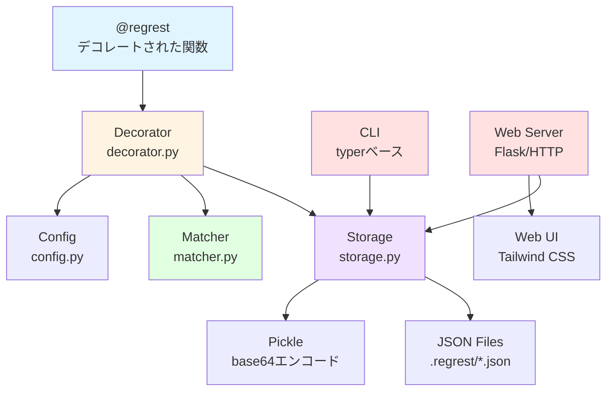

# Regrest

[English](https://github.com/eycjur/regrest/blob/main/README.md) | [日本語](https://github.com/eycjur/regrest/blob/main/README_ja.md)

[](https://badge.fury.io/py/regrest)
[](https://www.python.org/downloads/)
[](https://opensource.org/licenses/MIT)
[](https://github.com/eycjur/regrest/actions/workflows/test.yml)
[](https://github.com/eycjur/regrest/actions/workflows/static_analysis.yml)
[](https://deepwiki.com/eycjur/regrest)

**Regrest** は、Pythonのための自動回帰テスト & デバッグ支援ツールです。初回実行時に関数の出力を自動的に記録し、その後の実行で検証しながら、複雑なデータフローを理解するための強力な可視化機能を提供します。

## 特徴

- 🎯 **ゼロコストで回帰テスト** - テストコードを書かずに意図しない変更を検出
- 📝 **テストの自動生成** - `@regrest`デコレーターを追加するだけで、テストが自動作成
- 🔬 **ビジュアルデバッグ** - 関数の入出力を可視化し、複雑なデータフローを理解
- 📊 **美しいWebダッシュボード** - シンタックスハイライトと階層的ナビゲーションで記録を探索
- ⚡ **デバッグサイクルの高速化** - 保存された入力で問題を即座に再現
- 📚 **生きたドキュメント** - 実際の実行から関数の振る舞い例を自動生成

## 要件

- Python 3.9 以上

## インストール

```bash
pip install regrest

# オプション: サーバーのパフォーマンス向上のためFlaskをインストール
pip install regrest[server]
```

## クイックスタート

### 基本的な使い方

```python
from regrest import regrest

@regrest
def calculate_price(items, discount=0):
    total = sum(item['price'] for item in items)
    return total * (1 - discount)

# 初回実行：結果を記録
items = [{'price': 100}, {'price': 200}]
result = calculate_price(items, discount=0.1)  # 270.0を返し、記録
# 出力: [regrest] Recorded: __main__.calculate_price (id: abc123...)

# 2回目以降：記録と比較
result = calculate_price(items, discount=0.1)  # 270.0を返し、記録と比較
# 出力: [regrest] Passed: __main__.calculate_price (id: abc123...)
```

### カスタム許容誤差

```python
@regrest(tolerance=1e-6)
def calculate_pi():
    return 3.14159265359
```

### 更新モード

既存の記録をテストではなく更新する場合：

```python
@regrest(update=True)
def my_function():
    return "new result"
```

または環境変数を使用：

```bash
REGREST_UPDATE_MODE=1 python your_script.py
```

## 環境変数

| 変数 | 説明 | 値 | デフォルト |
|------|------|----|----|
| `REGREST_LOG_LEVEL` | ログレベル | DEBUG, INFO, WARNING, ERROR, CRITICAL | `INFO` |
| `REGREST_RAISE_ON_ERROR` | テスト失敗時に例外を投げる | True/False | `False` |
| `REGREST_UPDATE_MODE` | すべての記録を更新 | True/False | `False` |
| `REGREST_STORAGE_DIR` | カスタムストレージディレクトリ | ディレクトリパス | `.regrest` |
| `REGREST_FLOAT_TOLERANCE` | 浮動小数点の許容誤差 | 数値 | `1e-9` |

**優先順位**: コンストラクタ引数 > 環境変数 > デフォルト値

## ユースケース

### 1. 回帰テスト（主な用途）

関数の振る舞いが意図せず変更されることを自動的に検出：

```python
@regrest
def calculate_discount(price, customer_type):
    # 変更されるべきでないビジネスロジック
    return price * get_discount_rate(customer_type)

# 初回実行：結果を記録
calculate_discount(100, "premium")  # 記録: 85.0

# その後：ロジックが誤って変更されるとテスト失敗
calculate_discount(100, "premium")  # 結果が85.0でない場合は失敗
```

### 2. デバッグと可視化

入出力を可視化することで複雑なデータフローを理解：

```python
@regrest
def process_pipeline(data):
    """複雑なデータ変換。"""
    return transform(filter(validate(data)))

# 一度実行して記録
process_pipeline(raw_data)

# CLIで可視化
$ regrest list -k process_pipeline
# 表示: args、kwargs、結果を読みやすい形式で

# またはWeb UIで閲覧
$ regrest serve
# http://localhost:8000 にアクセス
# シンタックスハイライト付きで入出力を確認
```

**デバッグのメリット**：
- 📸 **複雑なオブジェクトのスナップショット** - ネストしたデータ構造の正確な状態を確認
- 🔄 **時系列での変更追跡** - コード変更に伴う出力の変化を比較
- 👁️ **視覚的な検査** - JSONesque表示のWeb UIで簡単に読める
- 🐛 **問題の再現** - 保存された入力で簡単にバグを再現

### 3. 実例によるドキュメント

関数の振る舞いの実例を生成：

```python
@regrest
def api_response_formatter(user_data):
    """API レスポンス用にユーザーデータをフォーマット。"""
    return {
        "id": user_data["id"],
        "name": f"{user_data['first']} {user_data['last']}",
        "email": user_data["email"].lower(),
    }

# サンプル入力で実行
api_response_formatter({"id": 1, "first": "太郎", "last": "山田", "email": "TARO@EXAMPLE.COM"})

# `regrest list` で実際の入出力例を表示
# APIドキュメントやオンボーディングに最適
```

## CLIコマンド

### 記録の一覧表示

```bash
regrest list              # すべての記録を表示
regrest list -k calculate # キーワードでフィルタリング
```

モジュール、関数、引数、結果、タイムスタンプを含むテスト記録の一覧を表示します。

### 記録の削除

```bash
regrest delete abc123def456      # IDで削除
regrest delete --pattern "test_*" # パターンで削除
regrest delete --all             # すべての記録を削除
```

### 記録の検証

```bash
regrest verify                      # すべての記録を検証
regrest verify -k calculate         # 'calculate'関数のみ検証
regrest verify --tolerance 0.001    # カスタム浮動小数点許容誤差
```

記録されたすべての関数を保存された引数で再実行し、出力が記録された結果と一致することを検証します。以下のような用途に便利です：
- CI/CDパイプラインでの回帰テストの実行
- リファクタリングが既存機能を破壊していないことの確認
- 依存関係の更新後の互換性チェック

**注意**: モジュールレベルで定義された関数でのみ動作します（テスト関数やクロージャ内の関数には対応していません）。

### Web UIの起動

```bash
regrest serve                    # localhost:8000で起動
regrest serve --port 8080        # カスタムポート
regrest serve --host 0.0.0.0     # 外部アクセスを許可
regrest serve --reload           # ホットリロードを有効化
```

`http://localhost:8000` にアクセスして以下の機能を利用できます：
- **階層的ビュー** - モジュール → 関数 → レコードで整理
- **検索 & フィルター** - キーワードで記録を検索
- **JSONesque表示** - シンタックスハイライト付きの読みやすい形式
- **レコード管理** - 個別またはすべての記録を削除

## アーキテクチャ

### システム全体図



## 仕組み

1. **初回実行**: `@regrest` でデコレートされた関数を呼び出すと、通常通り実行され、以下を保存します：
   - モジュール名と関数名
   - 引数（位置引数とキーワード引数）
   - 戻り値
   - タイムスタンプ

   記録は `.regrest/` ディレクトリにJSONファイルとして保存されます。

2. **その後の実行**: 同じ引数で次回呼び出すと：
   - 関数が実行される
   - 結果が記録された値と比較される
   - 一致する → テスト成功 ✅
   - 一致しない → `RegressionTestError` が発生 ❌

3. **更新モード**: 期待値を更新する必要がある場合：
   - `@regrest(update=True)` または `REGREST_UPDATE_MODE=1` を使用
   - 古い記録が新しい結果で置き換えられる

## 設定

| レベル | 用途 | 例 |
|--------|------|-----|
| **グローバル** | すべてのテストに適用 | `from regrest import Config, set_config`<br>`config = Config(storage_dir='.my_records', float_tolerance=1e-6)`<br>`set_config(config)` |
| **関数ごと** | 特定の関数に適用 | `@regrest(tolerance=1e-9)`<br>`def precise_calculation():`<br>`    return 3.141592653589793` |

## 高度な機能

### 比較ロジック

マッチャーは以下を賢く比較します：
- **プリミティブ型**: 文字列、真偽値は厳密一致
- **数値**: floatは許容誤差あり、整数は厳密一致
- **コレクション**: リスト、辞書、セットの深い比較
- **ネストした構造**: 詳細なエラーメッセージ付きの再帰的比較

## 保存形式

### ファイル構造

記録はJSONファイルとして `.regrest/` ディレクトリに保存されます：

```
.regrest/
├── .gitignore                                    # 自動生成
├── example.calculate_price.a1b2c3d4.json       # 記録ファイル
└── mymodule.process_data.e5f6g7h8.json        # 記録ファイル
```

### ファイル名の規則

`{module}.{function}.{record_id}.json`

| 要素 | 説明 | 例 |
|------|------|-----|
| `module` | 関数が定義されているモジュール名 | `example`, `mymodule` |
| `function` | 関数名 | `calculate_price`, `process_data` |
| `record_id` | 引数のSHA256ハッシュ（先頭16文字） | `a1b2c3d4e5f6g7h8` |

**レコードIDの生成**: 記録は以下で一意に識別されます：
1. モジュール名
2. 関数名
3. シリアライズされた引数のSHA256ハッシュ（args + kwargs）

つまり、**同じ関数でも引数が異なれば別々の記録が作成されます**。

### エンコーディング方式

Regrestは**ハイブリッドエンコーディング**方式を採用し、互換性と可読性を両立しています：

| データ型 | 保存方法 | 可読性 | 例 |
|---------|---------|--------|-----|
| **JSONシリアライズ可能**<br>(int, float, str, bool, list, dict, None) | JSON | ✅ あり | `{"result": {"type": "json", "data": 270.0}}` |
| **JSONシリアライズ不可**<br>(カスタムクラス、複雑なオブジェクト) | Pickle + Base64 | ❌ なし | `{"result": {"type": "pickle", "data": "gASV..."}}` |

**利点**：
- ✅ **可読性**: シンプルなデータ型はJSONで保存され、簡単に確認できる
- ✅ **柔軟性**: 複雑なオブジェクトは自動的にPickleでシリアライズ
- ✅ **バージョン管理フレンドリー**: JSON形式はクリーンなdiffを生成

**注意点**：
- ⚠️ **Pickle互換性**: Pythonバージョン間で問題が発生する可能性あり
- ⚠️ **カスタムクラス**: Pickleでシリアライズ可能である必要あり（比較は `__dict__` で自動的に行われる）

## コントリビューション

コントリビューションを歓迎します！Pull Requestをお気軽に送信してください。

送信前に以下を確認してください：
1. `make check` を実行してすべてのテストとリンターが通ることを確認
2. 新機能にはテストを追加
3. 必要に応じてドキュメントを更新

## ライセンス

MIT License

## 変更履歴

### 0.1.0（初回リリース）
- **PyPIへの公開** - `pip install regrest`でインストール可能
- コアデコレーター機能（`@regrest`）
- JSON/Pickleハイブリッドストレージシステム
- 浮動小数点許容誤差付きスマート比較
- CLIツール（`regrest list`, `regrest delete`）
- カスタムクラスのサポート
- 自動`.gitignore`生成
- 環境変数による設定
- カラフルなログ出力
- Python 3.9以上をサポート
- pyproject.tomlベースのビルドシステム
- ruff + mypyによる静的解析
- Makefileによるタスク自動化
- GitHub Actions CI/CD
